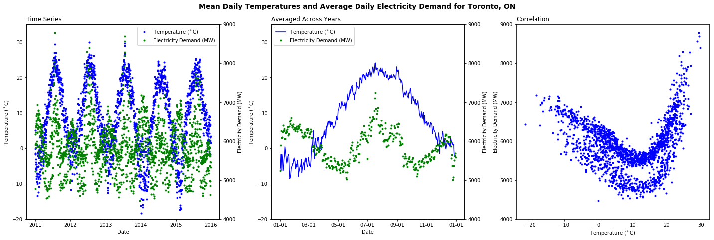

### A visualization that analyzes the relationship between mean daily temperature and daily electricity demand in Toronto
***
## Graph

## Data Sources
* Electricity demand data from [IESO](http://www.ieso.ca/en/power-data/data-directory) (Demands -> Zonal demands -> ZonalDemands_2003-2016)
* Average daily temperatures were obtained from the Government of Canada historical climate data for the Toronto City Centre station. All years from 2011 to 2016 are downloaded automatically by changing the [URL](http://climate.weather.gc.ca/climate_data/bulk_data_e.html?format=csv&stationID=48549&Year=2016&Month=3&Day=14&timeframe=2&submit=Download+Data)

## Analysis
The visualization was concerned with answering the question of how the daily electricity consumption in Toronto is related to the mean daily temperature. In particular, a time frame of 2011 Jan 1 to 2015 Dec 31 was arbitrarily chosen. Electricity demand data was taken from the IESO, and only the demand from the Toronto zone was used. Since the data is on an hourly basis, each set of 24 data points are averaged to produce an average daily demand. Temperature data from the Toronto City Centre weather station was taken from the Government of Canada. Only the mean temperature was used from this data set.

The first subplot shows the general trend of temperature and electricity demand as a function of time. The temperature is clearly cyclic with one cycle per year, while the pattern for electricity demand appears to be more complicated. The second subplot shows the temperature and electricity demand averaged across the five years to produce a single data point for each day. From this plot, it can be seen that the temperature has a cyclic trend as expected, and the electricity demand is also cyclic, with two cycles per year. It appears that the electricity usage is high at the start of the year, and decreases as the temperature increases up to about 15 deg C in May. This is presumably due to the amount of heating required in the winter (i.e. electric space heaters or electric blankets). In addition, days are also shorter during the winter, which would contribute to greater electricity consumption through lighting. As the temperature increases further from May to August, the electricity demand then increases, presumably as A/C usage ramps up. From this, one might expect that the electricity demand is highest when the temperature is very low and very high, and drops as temperatures become mild. Indeed, looking at the third subplot, when electricity demand is plotted directly against the temperature where each point represents a single day, there is a parabolic trend. Therefore, it can be concluded that the electricity demand is highest when temperature is at either extreme, and lowest when the temperature is moderate.
